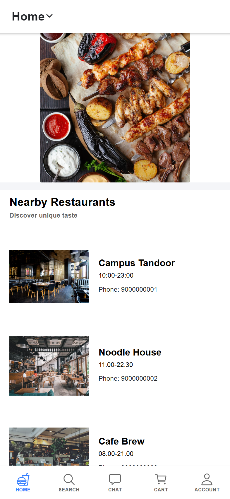
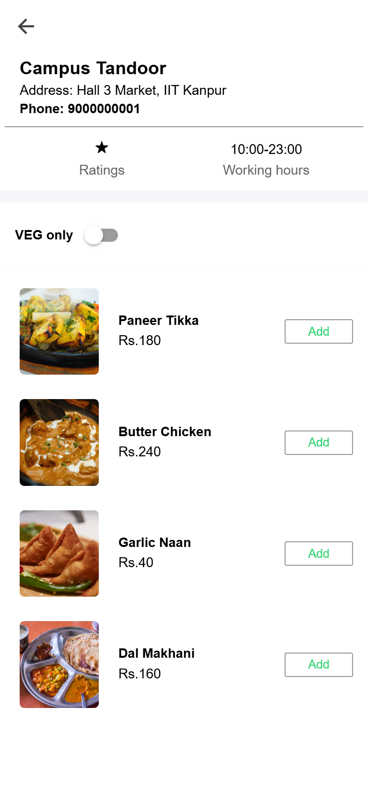
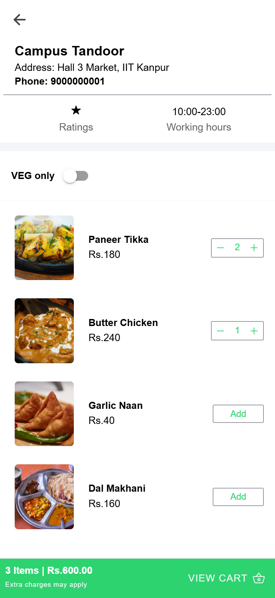
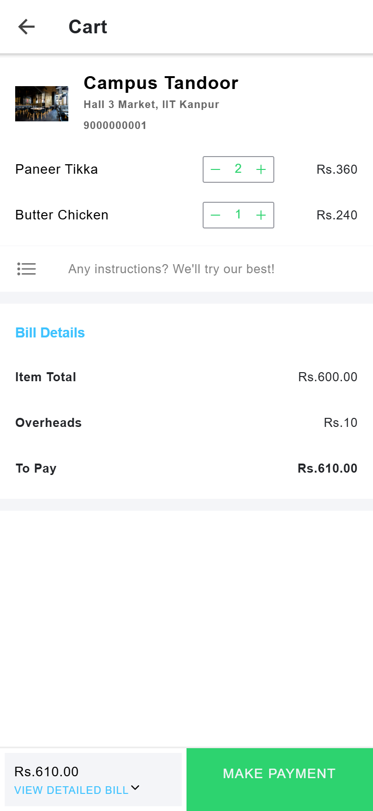
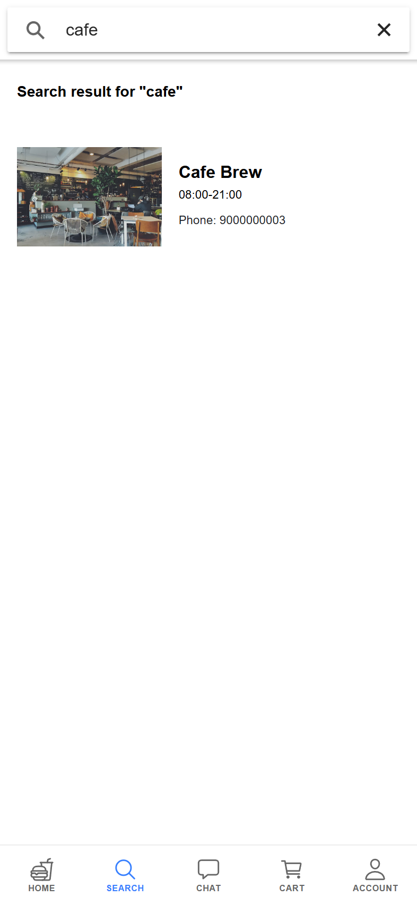

# LIFO — Campus Food Ordering App

[](https://github.com/shashvat-singham/LIFO_INTERN/actions/workflows/ci.yml)
[](LICENSE)
[](https://ionicframework.com/)
[](https://angular.io/)
[](https://nodejs.org/)

A full-stack food ordering platform for campus restaurants. Users browse nearby
restaurants, filter veg-only menus, build a cart, and pay online; restaurants
receive and prepare orders. Built as an Ionic/Angular mobile app (Android via
Capacitor) backed by a Node.js/Express REST API and MongoDB.

## Screenshots

| Login | Home | Restaurant Menu |
|:---:|:---:|:---:|
|  |  |  |

| Building a Cart | Cart & Checkout | Search |
|:---:|:---:|:---:|
|  |  |  |

## Features

- **Phone + password auth** with bcrypt hashing and JWT sessions
- **Restaurant discovery** — browse, search, and view working hours and ratings
- **Menus with veg-only filter**, item images, and per-item quantity controls
- **Cart & billing** — itemized bill, overheads, and Cashfree payment integration
- **Order tracking** for users and restaurants, with email notification when an order is ready
- **Image uploads** for dishes (multer, type-validated, size-limited)

## Architecture

```
┌────────────────┐     /api/v1, /public/uploads      ┌─────────────────┐
│  Ionic/Angular  │ ────────────────────────────────▶ │  Express API     │
│  (nginx :8080)  │          proxied by nginx         │  (Node :5000)    │
└────────────────┘                                    └───────┬─────────┘
        │ Capacitor                                           │ mongoose
        ▼                                                     ▼
   Android APK                                        ┌─────────────────┐
                                                      │  MongoDB :27017  │
                                                      └─────────────────┘
```

- `LIFO/` — Ionic 6 / Angular 14 app (Capacitor Android project included)
- `backend/` — Express REST API: auth, restaurants, dishes, orders, payments
- In Docker, nginx serves the compiled app and reverse-proxies API calls, so the
  frontend needs no hardcoded backend URL in production

## Quick Start (Docker)

Requires Docker with the Compose plugin. No local Node.js or MongoDB needed.

```bash
git clone https://github.com/shashvat-singham/LIFO_INTERN.git
cd LIFO_INTERN
cp .env.example .env        # set JWT_SECRET to a long random string
docker compose up -d --build
```

Seed demo data (3 restaurants, 12 dishes, and a demo user):

```bash
docker compose exec backend npm run seed
```

| Service  | URL |
|----------|-----|
| App      | http://localhost:8080 |
| API      | http://localhost:5000/api/v1 |
| Health   | http://localhost:5000/health |

**Demo login:** phone `9999999999`, password `demo1234`

## Local Development

### Backend

```bash
cd backend
cp .env.example .env        # point MONGODB_CONNECT at your MongoDB
npm install
npm run seed                # optional demo data
npm run dev                 # nodemon on :5000
```

### Frontend

```bash
cd LIFO
npm install
npm start                   # dev server on :4200, expects API on :5000
```

The dev API base URL lives in `LIFO/src/environments/environment.ts`; the
production build uses the relative `/api/v1/` path behind nginx.

### Android

```bash
cd LIFO
npm run build -- --configuration production
npx cap sync android
npx cap open android        # build APK from Android Studio
```

## Environment Variables

| Variable | Required | Default | Description |
|----------|:---:|---------|-------------|
| `MONGODB_CONNECT` | ✅ | — | MongoDB connection string |
| `JWT_SECRET` | ✅ | — | Secret for signing JWTs |
| `PORT` | | `5000` | API port |
| `API_URL` | | `/api/v1` | API route prefix |
| `DB_NAME` | | `lifo` | Database name |
| `CORS_ORIGIN` | | `*` | Allowed CORS origin |
| `CASHFREE_APP_ID` / `CASHFREE_APP_SECRET` | | — | Cashfree payment gateway (payments return 503 if unset) |
| `SMTP_USER` / `SMTP_PASS` / `SMTP_SERVICE` / `SMTP_FROM` | | — | Order-ready email notifications (skipped if unset) |

## API Overview

| Method | Endpoint | Description |
|--------|----------|-------------|
| `POST` | `/api/v1/user` | Register user |
| `POST` | `/api/v1/user/login` | Login — returns profile + JWT |
| `GET`  | `/api/v1/restaurant` | List restaurants |
| `POST` | `/api/v1/restaurant/login` | Restaurant login |
| `GET`  | `/api/v1/dish?id=<restaurantId>` | Menu for a restaurant |
| `GET`  | `/api/v1/dish/get/top` | Featured dishes |
| `POST` | `/api/v1/order` | Place order |
| `GET`  | `/api/v1/order/userOrders?id=<userId>` | User's order history |
| `GET`  | `/api/v1/order/restaurantOrders?id=<restaurantId>` | Restaurant's orders |
| `POST` | `/api/v1/order/cftoken` | Cashfree payment token |
| `GET`  | `/health` | Liveness/readiness probe |

## Production Notes

- Both images ship with `HEALTHCHECK`s; the API exposes `/health` for orchestrators
- The backend runs as a non-root user, sits behind helmet security headers, and
  rate-limits login endpoints
- Uploaded dish images persist in the `uploads` named volume
- CI builds the backend, the frontend production bundle, and both Docker images
  on every push and pull request

## License

Apache-2.0 — see [LICENSE](LICENSE).
